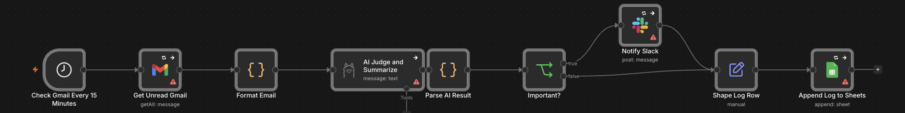
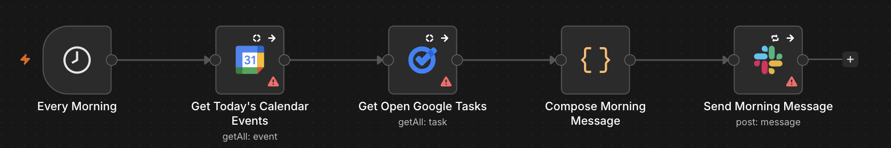
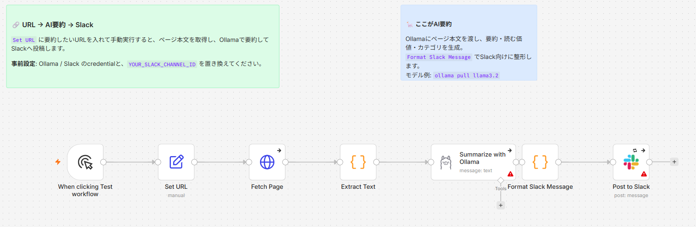

# n8n AI Workflow Starter JA

日本語ユーザー向けの、n8n + AI 自動化ワークフロー集です。

Gmail、Slack、Google Calendar、Google Tasks、Google Sheets、Ollamaを組み合わせた、インポートして試せるn8n workflowサンプルをまとめています。

> **検証環境**: n8n `2.23.4` で動作確認しています（PostgreSQL 18 / Docker）。

## Features

- n8nをDockerで動かすための最小構成サンプル
- Gmail、Slack、Google Calendar、Google Tasks、Google Sheetsを使ったworkflowサンプル
- Ollamaを使ったAI要約、優先度判定、Slack通知、日次確認のワークフローパターン

## Repository Structure

```text
.
├── docker-compose.example.yml
├── .env.example
├── SECURITY.md
├── workflows/
│   ├── gmail-ai-summary-to-slack-sheets.n8n.json
│   ├── morning-slack-secretary.n8n.json
│   ├── slack-monitor-ai-to-sheets.n8n.json
│   ├── slack-daily-digest-starter.n8n.json
│   ├── slack-task-to-google-tasks-calendar.n8n.json
│   └── slack-url-ai-summary.n8n.json
```

## Quick Start

1. `.env.example` をコピーして `.env` を作成します。
2. 必要な値を自分の環境に合わせて設定します。
3. n8nを起動します（`docker compose -f docker-compose.example.yml up -d`）。
4. `http://localhost:5678` にアクセスします。
5. `workflows/` 配下のサンプルをn8nにインポートします。

詳しい手順は [セットアップガイド](docs/setup-guide-ja.md) を参照してください。

## Example Use Cases

- 毎朝、Google Calendar の予定をSlackへ通知
- Gmailの重要メールをAIで要約してSlackへ転送
- Slackに書いたタスクをGoogle Sheetsやカレンダーに登録
- Slackチャンネルの投稿をAIで要約し、重要なものだけ通知
- URLを渡すと、ページ本文をAIで要約してSlackへ投稿

## Included Workflows

各workflowはimport後、ノードごとにcredentialを割り当て、`YOUR_...` などのプレースホルダー値を自分の環境に置き換えてから使ってください。

### gmail-ai-summary-to-slack-sheets

Gmailの未読メールを定期取得し、Ollamaで重要度判定・要約します。重要メールはSlackへ通知し、結果をGoogle Sheetsへログ保存します。



### slack-task-to-google-tasks-calendar

Slack slash commandを署名検証し、タスクをGoogle Tasksへ登録します。メッセージに時刻が含まれていればGoogle Calendarにも予定を作成します。


### morning-slack-secretary

毎朝、Google Calendarの今日の予定とGoogle TasksのTop3をまとめてSlackへ通知します。



### slack-monitor-ai-to-sheets

Slackチャンネルを直接読み、Ollamaで重要度・カテゴリ・要約を作成します。重要投稿をSlack通知し、結果をGoogle Sheetsへ追記します。

### slack-daily-digest-starter

Slackメッセージ取得の最小スターターです（2ノード）。n8nの基本動作を確認する入り口として使えます。

### slack-url-ai-summary

`Set URL` にURLを入れて手動実行すると、ページ本文を取得し、Ollamaで要約・カテゴリ判定してSlackへ投稿します。手動トリガーなので、importしてすぐ単体で試せます。



## License

MIT
