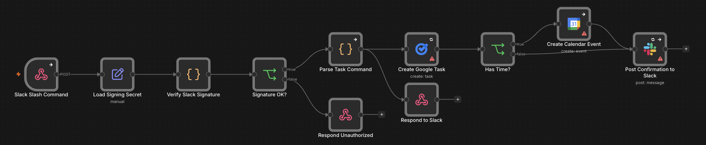

# n8n AI Workflow Starter JA

日本語ユーザー向けの、n8n + AI 自動化ワークフロー集です。

Gmail、Slack、Google Calendar、Google Tasks、Google Sheets、Ollamaを組み合わせた、インポートして試せるn8n workflowサンプルをまとめています。

## Features

- n8nをDockerで動かすための最小構成サンプル
- Gmail、Slack、Google Calendar、Google Tasks、Google Sheetsを使ったworkflowサンプル
- Ollamaを使ったAI要約、優先度判定、Slack通知、日次確認のワークフローパターン

## Repository Structure

```text
.
├── docker-compose.example.yml
├── .env.example
├── SECURITY.md
├── workflows/
│   ├── gmail-ai-summary-to-slack-sheets.n8n.json
│   ├── morning-slack-secretary.n8n.json
│   ├── slack-monitor-ai-to-sheets.n8n.json
│   ├── slack-daily-digest-starter.n8n.json
│   └── slack-task-to-google-tasks-calendar.n8n.json
```

## Quick Start

1. `.env.example` をコピーして `.env` を作成します。
2. 必要な値を自分の環境に合わせて設定します。
3. n8nを起動します。

```bash
docker compose -f docker-compose.example.yml up -d
```

4. `http://localhost:5678` にアクセスします。
5. `workflows/` 配下のサンプルをn8nにインポートします。

詳しい手順は [セットアップガイド](docs/setup-guide-ja.md) を参照してください。

## Example Use Cases

- 毎朝、Google Calendar の予定をSlackへ通知
- Gmailの重要メールをAIで要約してSlackへ転送
- Slackに書いたタスクをGoogle Sheetsやカレンダーに登録
- Slackチャンネルの投稿をAIで要約し、重要なものだけ通知

## Screenshots

### Slack task command workflow

Imported workflow example. Configure credentials and placeholder values before running.



## Included Workflows

| File | What it does |
| --- | --- |
| `gmail-ai-summary-to-slack-sheets.n8n.json` | Gmailの未読メールを取得し、Ollamaで重要度判定・要約し、重要メールをSlack通知してSheetsへログ保存します。 |
| `slack-task-to-google-tasks-calendar.n8n.json` | Slack slash commandを署名検証し、タスクをGoogle Tasksへ登録します。時刻つきならGoogle Calendarにも登録します。 |
| `morning-slack-secretary.n8n.json` | 毎朝、Google Calendarの今日の予定とGoogle TasksのTop3をSlackへ通知します。 |
| `slack-monitor-ai-to-sheets.n8n.json` | Slackチャンネルを直接読み、Ollamaで重要度・カテゴリ・要約を作成し、重要投稿をSlack通知して結果をSheetsへ追記します。 |
| `slack-daily-digest-starter.n8n.json` | Slackメッセージ取得の最小スターターです。 |

## License

MIT
